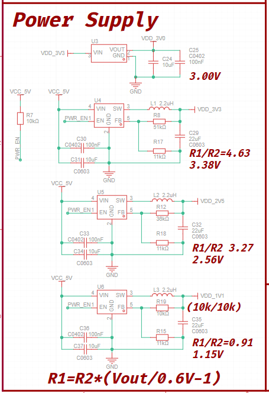

<h1 align="center">关断状态漏电的分析与处理</h1>

> ## 目录

- [名词解释](#名词解释)
- [写在前面](#写在前面)
- [核心板](#核心板)
- [底板](#底板)
- [参考资料](#参考资料)

## 名词解释
| 名词 | 解释 |
| --- | --- |

## 写在前面

本文将从问题入手，通过功耗计以及板上资源，分析漏电问题出在哪里

本文的另一个目的是为了降低待机功耗，但本文仅涉及硬件部分，软件部分的请到`软件->电源管理`查看

## 核心板

初始状态： 漏电 480uA

我们知道，PCB常见的漏电问题，有如下几个原因：

- 上拉电阻的大小
- DC-DC的静态电流
- LDO的静态电流

在本案例中，通过 `PWR_EN` 信号将三路DC-DC关闭后，又因3V LDO 的上级是3V3的DC-DC

那么板上就只有如下耗电点了：

- DC-DC的关断电流
- 10K上拉电阻的电流

我们的DC-DC芯片，型号为JW5211，通过查阅手册得知电气参数如下

那么三颗DC-DC漏电量范围为：0.3uA - 3uA

10K上拉电阻的电流值，可通过代入`欧姆定律`公式计算得

Ir = 5000mV/10000R = 500uA

又因该电阻容量+-5%，所以可以得知

| | 耗电量 |
| --- | --- |
| 最大值 | 526uA |
| 最小值 | 476uA |

结论:

- 将该电阻替换为100k或者1M大小的，可以进一步降低耗电量

### 实验

| 实测上拉电阻的大小对静态电流的影响 | |
| --- | --- |
| 阻值 | 电流 |
| 100K | 50uA |
| 1M | 5 uA |

### 优化结果

待添加

## 底板

初始状态： 漏电 850 uA