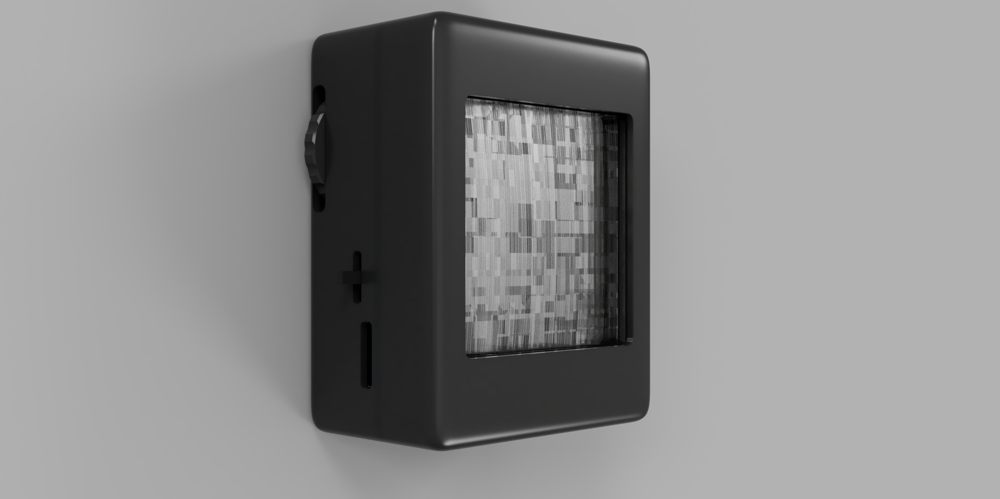
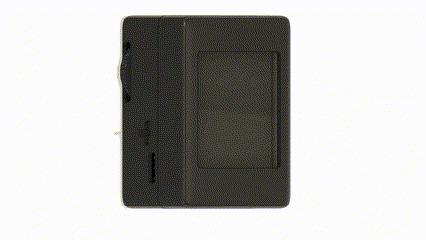
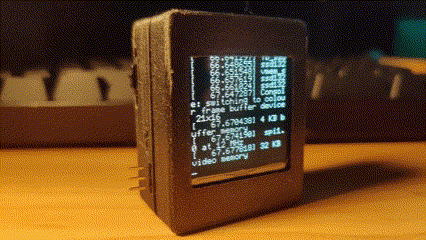
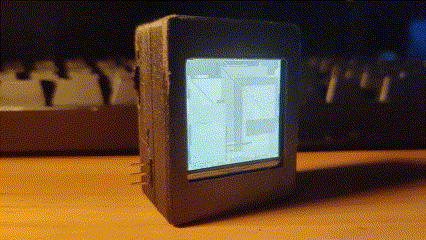
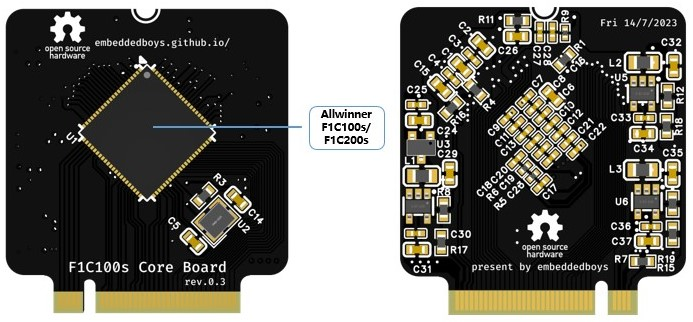
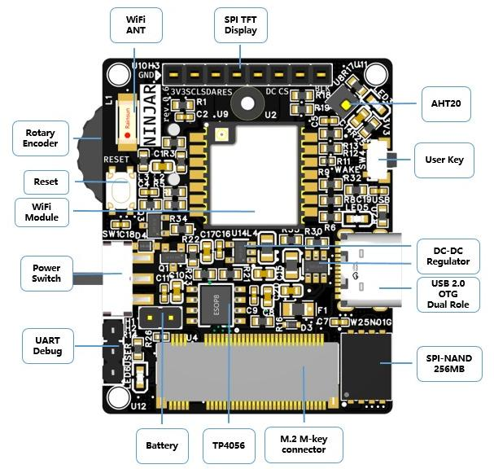

<h1 align="center">
    
    项目开发中。。。
    
</h1>

[[ 中文 ]](README.md) [[ English ]](README.en.md)

`项目官网` : [`https://embeddedboys.github.io/NINJAR-lite`](https://embeddedboys.github.io/NINJAR-lite)

`文档链接` : [`https://embeddedboys.github.io/NINJAR-lite`](https://embeddedboys.github.io/NINJAR-lite)

`项目仓库` : [`https://github.com/emmbeddedboys/NINJAR-lite`](https://github.com/emmbeddedboys/NINJAR-lite)

<!-- 这里可以放项目的预览图 -->

## <h2 align="center">介绍</h2>

<!-- 有关项目的简短介绍 -->

<strong>NINJAR (NINJAR Is Not Just A Reader)</strong> 作为一款掌上阅读器，但远远不止这样

正如我们演示的那样，通过外接无线键盘，它可以当作一台掌上终端来使用

通过开源的的设计、软件资料，这个设备的形态可以被重新定义，这得益于模块化的设计

这个项目正处于开发阶段，我们正在尝试加入更多的创客功能，以支持模块拓展

> 
<strong>NINJAR-lite</strong> 是基于全志 F1C100s 设计的精简版本

## <h2 align="center">实机演示</h2>
<!-- 快速简短的GIF玩法展示 -->

## <h2 align="center">设计</h2>

<!-- 简短的设计过程 -->

<strong>顶视图</strong>

> 
器件以实物为准

## <h2 align="center">配置</h2>

<!-- 有关设备资源的表格 -->

| 组件       | 型号                          |
|------------|-------------------------------|
| 系统       | linux、Debian 12             |
| CPU        | Allwinner F1C100s/F1C200s ARM9 700MHz |
| 内存       | 32/64MB DDR1 256MHz              |
| 存储       | 128/256MB SPI-Nand Flash              |
| 屏幕       | 1.28英寸 16灰阶 OLED 128x128         |
| 网络       | 2.4G WiFi AP                  |
| 定位       | GP-02 GPS/BDS 模组            |
| 控制       | 拨轮编码器、按键               |
| 传感器     | AHT20                         |
| 电池       | 450mAh                        |
| 充放电 | TP4056 MOSFET                    |
| 接口 | 2x5 Pin Header with I2C1,I2S, SH1.0mm 4Pin I2C0, USB 2.0 OTG, Dual Role |

## <h2 align="center">许可证</h2>

此项目发布于`MIT`许可证下，更多详细信息，请查看`关于->许可证`

## <h2 align="center">致谢</h2>
<!-- 对该项目做出贡献的组织或个人 -->

玩得开心！  
干杯, 
iotah   

<h2 align="center">
      
    
</h2>
<h2 align="center">
    <a href="https://embeddedboys.github.io/">embeddedboys</a> 献上
</h2>
