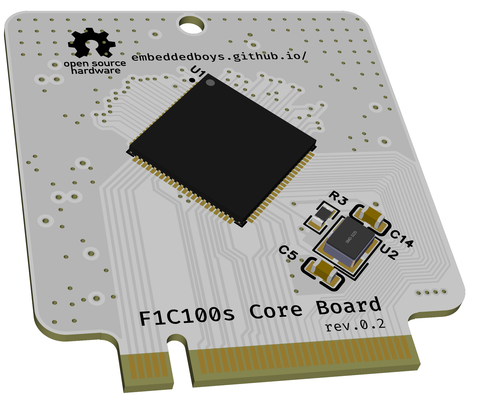
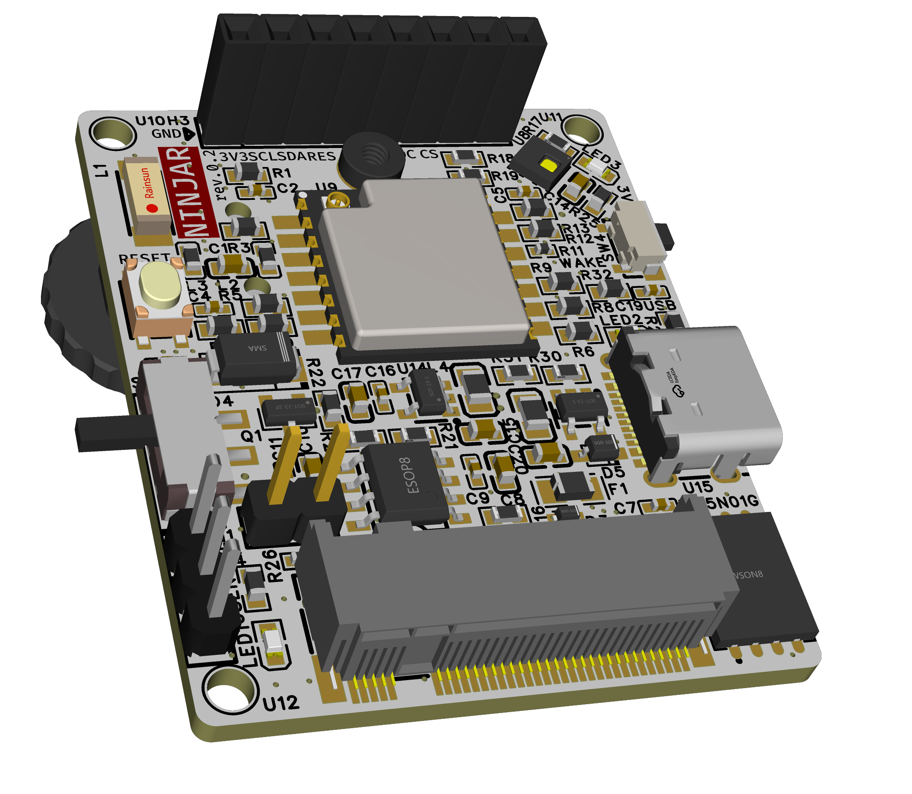

<h1 align="center">
    NINJAR-lite
</h1>

[[ 中文 ]](README.md) [[ English ]](README.en.md)

项目官网 : [https://embeddedboys.github.io/NINJAR-lite](https://embeddedboys.github.io/NINJAR-lite)

项目仓库 : [https://github.com/emmbeddedboys/NINJAR-lite](https://github.com/emmbeddedboys/NINJAR-lite)

<!-- 这里可以放项目的预览图 -->

<strong>项目底板</strong>

---------------------------

<h2 align="center">
    介绍
</h2>

<!-- 有关项目的简短介绍 -->

<strong>NINJAR (NINJAR Is Not Just A Reader)</strong> 是一款掌上阅读器，但远不止这样。

NINJAR-lite 是基于全志F1C100s设计的精简版本，正因为有集成度如此高的Soc，才使得设备做的如此小巧 (35mm x 43mm)。

<h2 align="center">
    玩法
</h2>
<!-- 快速简短的GIF玩法展示 -->

<h2 align="center">
    设计
</h2>

<!-- 简短的设计过程 -->

<strong>顶视图</strong>

暂未添加

<h2 align="center">
    配置
</h2>

<!-- 有关设备资源的表格 -->

| 组件       | 型号                          |
|------------|-------------------------------|
| 系统       | linux、Debian 12             |
| CPU        | Allwinner F1C100s ARM9 700MHz |
| 内存       | 32MB DDR1 256MHz              |
| 存储       | 256MB Nand Flash              |
| 屏幕       | 1.28英寸 16灰阶 OLED          |
| 网络       | 2.4G WiFi AP                  |
| 定位       | GP-02 GPS/BDS 模组            |
| 控制       | 拨轮编码器、按键               |
| 传感器     | AHT20                         |
| 电池       | 400/800mAh                        |
| 充放电管理 | TP4056 MOSFET                    |

<h2 align="center">
    许可证
</h2>

此项目发布于`MIT`许可证下，更多详细信息，请查看`关于->许可证`

<h2 align="center">
    致谢
</h2>

<!-- 对该项目做出贡献的组织或个人 -->

玩得开心！

干杯,

<h2 align="center">
    
</h2>
<h2 align="center">
    <a href="https://embeddedboys.github.io/">embeddedboys</a> 献上
</h2>